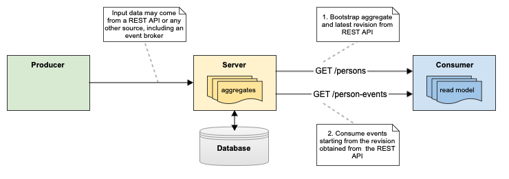
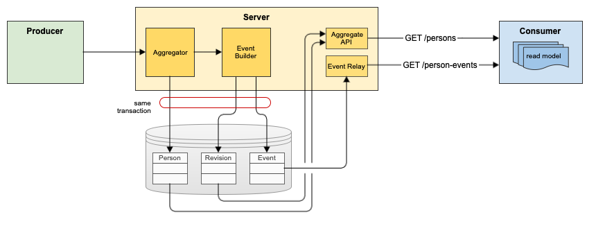

# Aggregate-Event Duality

This project demonstrates how a service can provide both aggregates and their corresponding change events.

An _aggregate_ is a JSON document that contains hierarchical data, covering a certain domain.
An example aggregate may contain the data of all persons in a company, university, or similar.
Another aggregate may provide a grouping of all bespoken persons by their locations.
Aggregates can be built from any source. In this project, they are created via REST requests, as shown in the table below.
Aggregates are delivered to consumers via traditional HTTP ``GET`` requests.

| #   | Input operation                                   | Resulting person aggregate                                    |
|-----|---------------------------------------------------|---------------------------------------------------------------|
| 1   | ``POST /persons {"name":"Hans","city":"Berlin"}`` | ``{"1":{"name":"Hans","city":"Berlin"}}``                     |
| 2   | ``POST /persons {"name":"Inge"}``                 | ``{"1":{"name":"Hans","city":"Berlin"},"2":{"name":"Inge"}}`` |
| 3   | ``PATCH /persons/1 {"city":null}``                | ``{"1":{"name":"Hans"},"2":{"name":"Inge"}}``                 |
| 4   | ``DELETE /persons/1``                             | ``{"2":{"name":"Inge"}}``                                     |

Every _change event_ encodes the difference between two states of an aggregate.
A consumer can rebuild the aggregate by listening to the stream of change events.
The protocol of choice is [JSON Merge Patch](https://www.rfc-editor.org/rfc/rfc7386)
(not to be confused with [JSON Patch](https://jsonpatch.com)).

| #   | Input operation                                   | Resulting JSON Merge Patch event           |
|-----|---------------------------------------------------|--------------------------------------------|
| 1   | ``POST /persons {"name":"Hans","city":"Berlin"}`` | ``{"1":{"name":"Hans","city":"Berlin"}}``  |
| 2   | ``POST /persons {"name":"Inge"}``                 | ``{"2":{"name":"Inge"}}``                  |
| 3   | ``PATCH /persons/1 {"city":null}``                | ``{"1":{"city":null}}``                    |
| 4   | ``DELETE /persons/1``                             | ``{"1":null}``                             |

In contrast to [Event Sourcing](https://martinfowler.com/eaaDev/EventSourcing.html),
the consumer does not need to read the entire event stream.
It can bootstrap from the aggregate and keep itself up-to-date by applying subsequent changes.
Older events can be deleted, avoiding storage bottlenecks and potential GDPR violations.

The event stream can be transported by any messaging system such as [ActiveMQ](https://activemq.apache.org).
The approach chosen in this project utilizes [Server-Sent Events](https://developer.mozilla.org/en-US/docs/Web/API/Server-sent_events)
as a yet simpler solution. No shared infrastructure is required; both aggregates and events are delivered over HTTP,
although through different server endpoints.


 
The separation into two steps, bootstrapping and event consumption, requires synchronisation:
The consumer must receive change events in order. Moreover, it must not miss change events for the previously
loaded aggregate. The challenge here is on server side. The server must store the aggregate and publish
the corresponding change event in an atomic operation.

Atomicity can be guaranteed with the [Transactional Outbox](https://microservices.io/patterns/data/transactional-outbox.html)
pattern, which persists the aggregate and the corresponding event in one transaction.
A message relay periodically publishes new events and drops older ones.
On failure, events may be published repeatedly.
Therefore, events must be [idempotent](https://en.wikipedia.org/wiki/Idempotence).
This holds for the JSON Merge Patch protocol.



To match aggregate state and event, another table stores the latest _revision_ of the aggregate.
Every event in the outbox event table is annotated with the aggregate revision.
The aggregate endpoint delivers the revision in header ``X-Revision``.
```shell
curl -D - http://localhost:3000/persons
```
produces
```shell
HTTP/1.1 200 OK
content-type: application/json
x-revision: 7
```
After reading the aggregate, the consumer can use the revision value to subscribe to all subsequent change events:
```shell
curl -N -H "X-Revision: 8" http://localhost:3000/person-events
```
Note that the consumer may also use 7 or any smaller value instead, because the events are idempotent.
The only limitation is the event retention time on the server, which perodically deletes older events.

(TODO: Aggregate delivery in pages?)

## Installation
You need [Rust](https://www.rust-lang.org/tools/install) for the server (TODO: and [Node.js](https://nodejs.org/en/) to run the example consumer).
```shell
git clone https://github.com/mouton0815/aggregate-event-duality.git
cd aggregate-event-duality
cargo build
```

## Running
Start the server with
```shell
RUST_LOG=info cargo run
```
Note that the server uses an in-memory [SQLite](https://www.sqlite.org/index.html) database,
so the aggregates are lost on restart of the server. This can be changed by replacing the ``":memory:``
argument of the ``Aggregator`` constructor in [server.rs](src/bin/server.rs) by a path to a database file,
for example ``"database.db"``.

(TODO: Start the node.js example consumer)

## Playing
To build an aggregate and product the corresponding change events,
you need to create/update/delete persons via the REST endpoint of the server.
Example requests:
```shell
curl -X POST  -H 'Content-Type: application/json' -d '{"name":"Hans","city":"Berlin"}' http://localhost:3000/persons
curl -X POST  -H 'Content-Type: application/json' -d '{"name":"Inge"}' http://localhost:3000/persons
curl -X PATCH -H 'Content-Type: application/json' -d '{"city":null}' http://localhost:3000/persons/1
curl -X DELETE http://localhost:3000/persons/1
```
The aggregates are available at the following endpoints:
```shell
curl http://localhost:3000/persons
curl http://localhost:3000/locations
```
The corresponding change streams can be accessed via
```shell
curl -N -H "X-Revision: 1" http://localhost:3000/person-events
curl -N -H "X-Revision: 1" http://localhost:3000/location-events
```
For more examples, see [curl-examples.sh](curl-examples.sh).